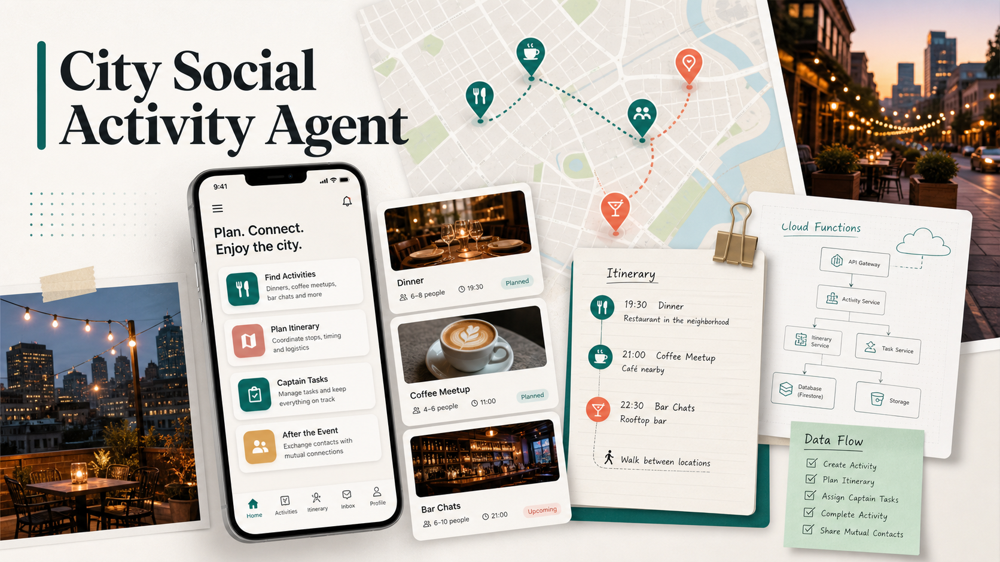

# City Social Activity Agent



> An AI-assisted city social activity MVP for safer offline dinners, coffee meetups, bar chats, itinerary coordination, captain tasks, and post-event mutual contact.
>
> 城市轻社交活动平台: 把「想出门认识人」变成一个可信、可执行、可反馈的线下活动闭环。

This repository is a product and engineering case study. It explores how a lightweight social product can help urban professionals join offline activities without turning the experience into a dating app, public group chat, or ticketing platform.

## Why This Exists

The core product question is simple:

> Can strangers feel safe enough to meet around one concrete offline activity, then decide after the event whether to open contact?

The MVP focuses on platform-created dinners, coffee meetups, bar chats, and free city activities. It models the full loop from activity discovery to signup, itinerary coordination, "Ju Zhang" captain tasks, settlement, feedback, and mutual contact.

## What Is Included

- **Clickable web prototype** for the product journey.
- **WeChat mini program app** with pages, services, and cloud function wiring.
- **Shared domain package** for activity, registration, reputation, settlement, and mutual-contact rules.
- **Cloud function source and generated deploy bundles** for a WeChat cloud-style backend.
- **Seed data and deployment scripts** for local iteration and cloud deployment preparation.
- **Product design docs and release materials** that capture decisions, review notes, and QA flow.
- **Test coverage** across domain rules, view models, services, cloud handlers, and deployment generation.

## Product Flow

1. **Discover activities**: time, area, budget/free label, participant status, and AI recommendation reason.
2. **Read activity detail**: AA/free rules, exit rules, privacy boundaries, participant preview, and activity atmosphere.
3. **Confirm signup**: accept rules and optionally volunteer as "Ju Zhang" for the activity.
4. **Use itinerary page**: formation status, meeting location, arrival confirmation, reminders, and captain entry.
5. **Run captain tasks**: accept or decline the role, view AI topic cards, coordinate arrival, and handle AA/free settlement state.
6. **Send feedback**: report issues, rate the experience, and choose who to mutually open contact with after the activity.

## Product Rules Captured

- Regular participants can exit more than 12 hours before an activity without internal reputation impact.
- A Ju Zhang who exits within 24 hours after accepting the role triggers reselection and a stronger internal reputation impact.
- Declining the Ju Zhang role does not affect activity participation.
- The first version does not expose exact reputation scores. It uses softer reputation levels and optional attendance history.
- No private messages or contact information are opened before the activity.
- Contact opens only after both participants mutually choose each other after the event.
- Paid activities use offline AA settlement. Free activities skip settlement and show a no-fee state.

## AI Touchpoints

AI is intentionally embedded into the workflow instead of being presented as a separate chatbot:

- activity recommendation reasons
- natural-language rule explanations
- formation and itinerary reminders
- Ju Zhang task cards
- AI-generated topic card prompts
- post-event feedback summarization hooks

## Architecture

```text
src/
  components/               Web prototype components
  domain/                   Prototype domain model and rules
apps/miniprogram/
  src/pages/                WeChat mini program pages
  src/services/             View models, service layer, cloud runtime clients
  cloudfunctions/           Mini program cloud function bundles
packages/domain/
  src/                      Shared domain logic
cloud/
  functions/src/            Cloud handlers, adapters, seed logic
  functions/deploy/         Generated deployment bundles
  seed/                     JSON and JSONL seed data
scripts/
  generate-cloud-seed.mjs
  generate-cloud-functions.mjs
  wechat-cloud-deploy.mjs
docs/
  miniprogram/              QA, release, cloud, and submission notes
  superpowers/              Design specs and implementation plans
```

## Tech Stack

- React
- TypeScript
- Vite
- Vitest
- Testing Library
- Lucide React
- Plain CSS
- WeChat mini program structure
- Cloud function deployment scripts
- npm workspaces

## Local Development

```bash
npm install
npm run dev
```

Run checks:

```bash
npm test
npm run build
```

Generate cloud-related artifacts:

```bash
npm run generate:cloud-seed
npm run generate:cloud-functions
npm run wechat:cloud-functions:dry-run
```

## Useful Docs

- [Cloud data model](docs/miniprogram/cloud-data-model.md)
- [Cloud functions](docs/miniprogram/cloud-functions.md)
- [Cloud adapter](docs/miniprogram/cloud-adapter.md)
- [Review submission materials](docs/miniprogram/review-submission-materials.md)
- [Release checklist](docs/miniprogram/release-checklist.md)

## Status

This is an MVP/prototype repository, not a production social network. The current value is in the product thinking, interaction loop, domain modeling, WeChat mini program implementation, and cloud-function-ready architecture.

## Visual Asset Note

The README banner was generated with an AI image model and committed as a project asset for presentation purposes.
